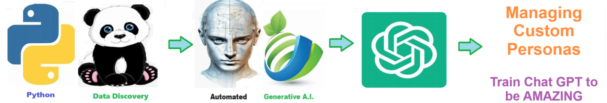
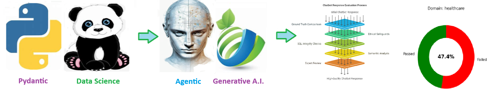
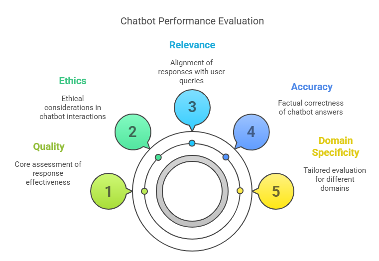
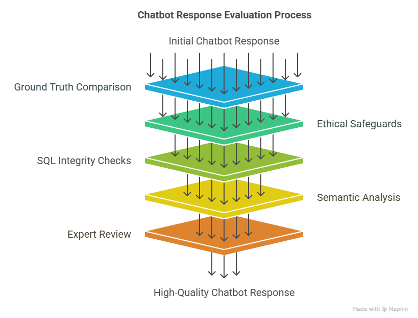

    
# Ai Chatbot Scorecard 

## The 7 Layer System Response Score is a comprehensive, domain specific evaluation framework that rates chatbot responses from 0 to 100.

    

    

Welcome to the solution **Ai Chatbot Scorecard** - an example for your projects

The 7 Layer System Response Score is a comprehensive, domain specific evaluation framework that rates chatbot responses from 0 to 100.

    

    
## Getting Started

The goal of this solution is to **Jump Start** your development and have you up and running in 30 minutes. 

To get started with the **Ai Chatbot Scorecard** solution repository, follow these steps:
1. Clone the repository to your local machine.
2. Install the required dependencies listed at the top of the notebook.
3. Explore the example code provided in the repository and experiment.
4. Run the notebook and make it your own - **EASY !**
    
## Solution Features

- Easy to understand and use  
- Easily Configurable 
- Quickly start your project with pre-built templates
- Its Fast and Automated
- Saves You Time 

## Code Features

These features are designed to provide everything you need for **Ai Chatbot Scorecard** 

- **Self Documenting** - Automatically identifes major steps in notebook 
- **Self Testing** - Unit Testing for each function
- **Easily Configurable** - Easily modify with **config.INI** - keyname value pairs
- **Includes Talking Code** - The code explains itself 
- **Self Logging** - Enhanced python standard logging   
- **Self Debugging** - Enhanced python standard debugging
- **Low Code** - or - No Code  - Most solutions are under 50 lines of code
- **Educational** - Includes educational dialogue and background material

    
## List of Figures
             
    

## Github https://github.com/JoeEberle/ - Email  josepheberle@outlook.com 
    

    