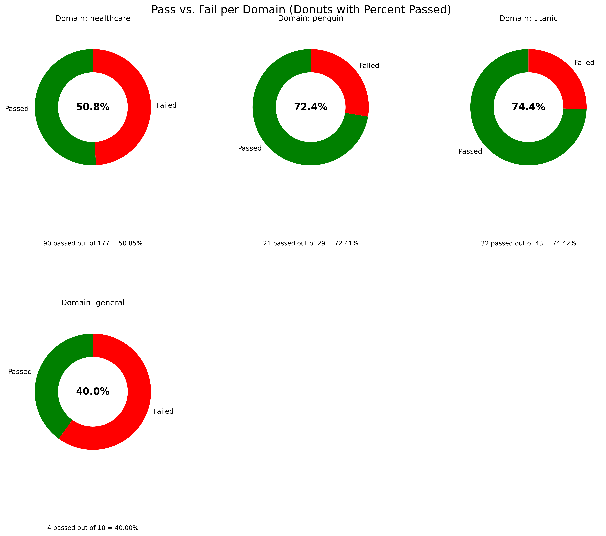
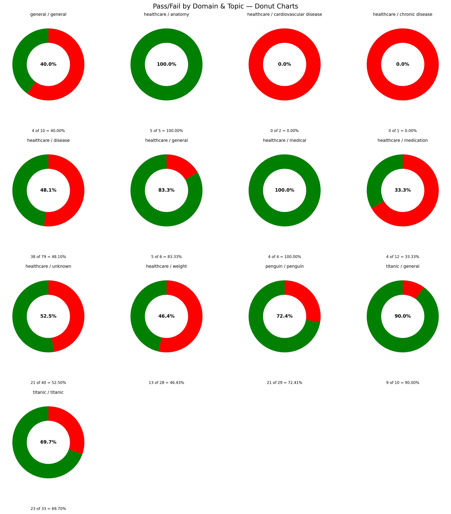

    
# Ai Chatbot Scorecard 

## The 7 Layer System Response Score is a comprehensive, domain specific evaluation framework that rates chatbot responses from 0 to 100.

    

    

Welcome to the solution **Ai Chatbot Scorecard** - an example for your projects

The 7 Layer System Response Score is a comprehensive, domain specific evaluation framework that rates chatbot responses from 0 to 100.

 

## 🧠 Chatbot Scorecard Summary Evaluating Performance by Topic & Domain

The 7 Layer System Response Score is a comprehensive, **domain specific evaluation framework** that rates chatbot responses from 0 to 100. 

It is not a confidence score, but rather a structured assessment of **quality**, **ethics**, **relevance**, and **accuracy** scored by 
**topic** and **domain**.

## 🧩 Purpose
This scorecard ensures chatbot performance is measured not just by how confidently it answers, but by how well, ethically,
and **factually** it answers across specific **healthcare domains** and **subtopics**.

# 7 layer system response score formulation

This is not the same as a confidence score 

## The proposed 7 layer data (100) system response score offers a comprehensive approach to scoring data responses 

### Layer 1 Descriptive Statistics and Ground Truth Matching (20 points)  
 **Statistical Approach** Utilize inverted `pandas.describe()` to compute summary statistics (mean, median, standard deviation, quartiles) for all numeric columns in the dataset. Establish ground truth by comparing these statistics against historical data or expected ranges predefined by domain experts. Include additional statistical tests such as Zscores or Ttests for anomaly detection, where deviations from historical norms are flagged for further review.

### Layer 2 Ethical Guardrail Analysis (10 points, 30 total) 
 **Refined Approach** Does the system acccurately identify hatred, bullying, sexism, racism, etc ? 

### Layer 3 SQL Database Integrity and Consistency Check (20 points, 50 total)  
 **Enhanced Approach** Perform SQL queries to replicate the descriptive statistics calculated in Layer 1 directly from the database. Use assertions in SQL to check that aggregates (sum, average, count, min, max) match those calculated in pandas. Include integrity checks for data types, null values, and referential integrity (e.g., foreign keys). Implement checksum or hash comparisons for entire datasets or critical subsets to ensure no discrepancies between the source data and what is loaded into the database.

### Layer 4 External Validation with Semantic Analysis (5 points, 55 total) 
 **Refined Approach** Instead of relying on potentially unavailable external internet sources for proprietary data, use semantic analysis technologies to validate data consistency and plausibility. This can involve using NLP tools to understand text datas context and meaning, comparing against a corpus of industryspecific documentation or previously validated datasets. For nonproprietary information, leverage external APIs or datasets for crossreferencing facts.

### Layer 5 Expert Clinical Review and Feedback Loop (5 points, 60 total)  
 **Enhanced Approach** Involve clinical SMEs or domain experts to manually review a random, statistically significant sample of the data, focusing on entries flagged by previous layers as anomalies or outliers. Use their feedback not only to validate the data but also to iteratively improve the data collection and cleaning processes. Record expert feedback and decisions in a learning database to refine the automated checks in Layers 1 and 2.

### Layer 6 Continuity and user feedback (20 to 20, 80 total)  
     Did user thumbs down (20) 
     Did user ask same question a different way (5)     
     Did user leave after response (5) 
     Did user continue researching after response (+10) 
     Did user thumbs up  (+20)     

### Layer 7 Performance (20 points, 100 total)  
 **New Layer Introduction** Implement machine learning models to predict data quality issues based on patterns identified in historical corrections (from Layer 4 feedback and Layer 1 anomalies). Continuously train and adjust these models as new data and feedback become available. Use this layer to proactively suggest potential errors and improve the overall resilience of the data validation framework.

### Implementing the Approach
1. **Automation and Monitoring** Automate as much of the scoring process as possible
2. **Data Governance** Establish a clear data governance framework that outlines the roles and responsibilities that is tune able.

# 🧠 7 Layer System Response Score Formulation

> **Note** This is **not** the same as a confidence score.  
> Instead, this scoring model evaluates the *quality*, *ethics*, and *factual accuracy* of chatbot responses   **by domain and topic**   on a **0 to 100 point scale**.

## Overview

The **7 Layer, 100 Point System** offers a structured and scalable approach to chatbot response evaluation, incorporating data validation, ethics checks, expert feedback, and user engagement.

## 🔍 Layer Breakdown

### **Layer 1 Descriptive Statistics & Ground Truth Matching** (20 points)
1. Leverages inverted `pandas.describe()` to summarize data (mean, median, std, etc.).
2. Compares outputs to domaindefined ground truth or expected historical values.
3. Includes Zscore and Ttest methods for anomaly detection.

### **Layer 2 Ethical Guardrail Analysis** (10 points, 30 total)
     Assesses detection of
       Hate speech  
       Racism, sexism  
       Bullying, misinformation  
     Evaluates whether responses violate ethical AI use.

### **Layer 3 SQL Database Integrity & Consistency** (20 points, 50 total)
 Verifies pandas stats with SQL equivalents (sum, avg, count, min, max).
 Enforces
   Data type integrity  
   Null value checks  
   Foreign key integrity  
   Checksumhash validation between source and processed data

### **Layer 4 External Validation via Semantic Analysis** (5 points, 55 total)
 Uses NLP to validate context, meaning, and consistency.
 Compares against trusted corpora or prior validated datasets.
 For nonproprietary topics, supports thirdparty APIs for factchecking.

### **Layer 5 Expert Clinical Review & Feedback Loop** (5 points, 60 total)
 Domain experts audit flagged outputs.
 Feedback informs
   Statistical assumptions  
   Ethical rule tuning  
   Layer 12 improvements  
 Feedback is logged in a learning database for reuse.

### **Layer 6 User Continuity & Feedback** (20 to +20, 80 total)
| Action                                    | Score Impact |
|||
| 👍 User gives thumbs up                  | +20          |
| 🔄 User continues researching topic       | +10          |
| 🤔 User rephrases same question           | 5           |
| 🚪 User leaves after response             | 5           |
| 👎 User gives thumbs down                | 20          |

### **Layer 7 Predictive Performance Modeling** (20 points, 100 total)
 Applies ML to learn from past feedback and error patterns.
 Predicts likely issues before they occur.
 Continuously retrains based on
   Outliers flagged in Layer 1  
   Expert feedback from Layer 5

## ⚙️ Implementation Recommendations

1. **Automate the scoring pipeline** wherever possible to reduce latency and scale evaluations.
2. **Embed data governance** standards that define responsible roles, auditability, and review cycles.
3. **Version control scoring rules** so that refinements are trackable across deployments.

Would you like this exported to a `.md` file or formatted into a PowerPoint slide deck next?

## 🧠 Chatbot Scorecard Summary Evaluating Performance by Topic & Domain

The 7 Layer System Response Score is a comprehensive, **domain specific evaluation framework** that rates chatbot responses from 0 to 100. 

It is not a confidence score, but rather a structured assessment of **quality**, **ethics**, **relevance**, and **accuracy** scored by 
**topic** and **domain**.

## 🧩 Purpose
This scorecard ensures chatbot performance is measured not just by how confidently it answers, but by how well, ethically,
and **factually** it answers across specific **healthcare domains** and **subtopics**.

# 7 layer system response score formulation

This is not the same as a confidence score 

## The proposed 7 layer data (100) system response score offers a comprehensive approach to scoring data responses 

### Layer 1 Descriptive Statistics and Ground Truth Matching (20 points)  
 **Statistical Approach** Utilize inverted `pandas.describe()` to compute summary statistics (mean, median, standard deviation, quartiles) for all numeric columns in the dataset. Establish ground truth by comparing these statistics against historical data or expected ranges predefined by domain experts. Include additional statistical tests such as Zscores or Ttests for anomaly detection, where deviations from historical norms are flagged for further review.

### Layer 2 Ethical Guardrail Analysis (10 points, 30 total) 
 **Refined Approach** Does the system acccurately identify hatred, bullying, sexism, racism, etc ? 

### Layer 3 SQL Database Integrity and Consistency Check (20 points, 50 total)  
 **Enhanced Approach** Perform SQL queries to replicate the descriptive statistics calculated in Layer 1 directly from the database. Use assertions in SQL to check that aggregates (sum, average, count, min, max) match those calculated in pandas. Include integrity checks for data types, null values, and referential integrity (e.g., foreign keys). Implement checksum or hash comparisons for entire datasets or critical subsets to ensure no discrepancies between the source data and what is loaded into the database.

### Layer 4 External Validation with Semantic Analysis (5 points, 55 total) 
 **Refined Approach** Instead of relying on potentially unavailable external internet sources for proprietary data, use semantic analysis technologies to validate data consistency and plausibility. This can involve using NLP tools to understand text datas context and meaning, comparing against a corpus of industryspecific documentation or previously validated datasets. For nonproprietary information, leverage external APIs or datasets for crossreferencing facts.

### Layer 5 Expert Clinical Review and Feedback Loop (5 points, 60 total)  
 **Enhanced Approach** Involve clinical SMEs or domain experts to manually review a random, statistically significant sample of the data, focusing on entries flagged by previous layers as anomalies or outliers. Use their feedback not only to validate the data but also to iteratively improve the data collection and cleaning processes. Record expert feedback and decisions in a learning database to refine the automated checks in Layers 1 and 2.

### Layer 6 Continuity and user feedback (20 to 20, 80 total)  
     Did user thumbs down (20) 
     Did user ask same question a different way (5)     
     Did user leave after response (5) 
     Did user continue researching after response (+10) 
     Did user thumbs up  (+20)     

### Layer 7 Performance (20 points, 100 total)  
 **New Layer Introduction** Implement machine learning models to predict data quality issues based on patterns identified in historical corrections (from Layer 4 feedback and Layer 1 anomalies). Continuously train and adjust these models as new data and feedback become available. Use this layer to proactively suggest potential errors and improve the overall resilience of the data validation framework.

### Implementing the Approach
1. **Automation and Monitoring** Automate as much of the scoring process as possible
2. **Data Governance** Establish a clear data governance framework that outlines the roles and responsibilities that is tune able.

# 🧠 7 Layer System Response Score Formulation

> **Note** This is **not** the same as a confidence score.  
> Instead, this scoring model evaluates the *quality*, *ethics*, and *factual accuracy* of chatbot responses   **by domain and topic**   on a **0 to 100 point scale**.

## Overview

The **7 Layer, 100 Point System** offers a structured and scalable approach to chatbot response evaluation, incorporating data validation, ethics checks, expert feedback, and user engagement.

## 🔍 Layer Breakdown

### **Layer 1 Descriptive Statistics & Ground Truth Matching** (20 points)
1. Leverages inverted `pandas.describe()` to summarize data (mean, median, std, etc.).
2. Compares outputs to domaindefined ground truth or expected historical values.
3. Includes Zscore and Ttest methods for anomaly detection.

### **Layer 2 Ethical Guardrail Analysis** (10 points, 30 total)
     Assesses detection of
       Hate speech  
       Racism, sexism  
       Bullying, misinformation  
     Evaluates whether responses violate ethical AI use.

### **Layer 3 SQL Database Integrity & Consistency** (20 points, 50 total)
 Verifies pandas stats with SQL equivalents (sum, avg, count, min, max).
 Enforces
   Data type integrity  
   Null value checks  
   Foreign key integrity  
   Checksumhash validation between source and processed data

### **Layer 4 External Validation via Semantic Analysis** (5 points, 55 total)
 Uses NLP to validate context, meaning, and consistency.
 Compares against trusted corpora or prior validated datasets.
 For nonproprietary topics, supports thirdparty APIs for factchecking.

### **Layer 5 Expert Clinical Review & Feedback Loop** (5 points, 60 total)
 Domain experts audit flagged outputs.
 Feedback informs
   Statistical assumptions  
   Ethical rule tuning  
   Layer 12 improvements  
 Feedback is logged in a learning database for reuse.

### **Layer 6 User Continuity & Feedback** (20 to +20, 80 total)
| Action                                    | Score Impact |
|||
| 👍 User gives thumbs up                  | +20          |
| 🔄 User continues researching topic       | +10          |
| 🤔 User rephrases same question           | 5           |
| 🚪 User leaves after response             | 5           |
| 👎 User gives thumbs down                | 20          |

### **Layer 7 Predictive Performance Modeling** (20 points, 100 total)
 Applies ML to learn from past feedback and error patterns.
 Predicts likely issues before they occur.
 Continuously retrains based on
   Outliers flagged in Layer 1  
   Expert feedback from Layer 5

## ⚙️ Implementation Recommendations

1. **Automate the scoring pipeline** wherever possible to reduce latency and scale evaluations.
2. **Embed data governance** standards that define responsible roles, auditability, and review cycles.
3. **Version control scoring rules** so that refinements are trackable across deployments.

Would you like this exported to a `.md` file or formatted into a PowerPoint slide deck next?

## 🧠 Chatbot Scorecard Summary Evaluating Performance by Topic & Domain

The 7 Layer System Response Score is a comprehensive, **domain specific evaluation framework** that rates chatbot responses from 0 to 100. 

It is not a confidence score, but rather a structured assessment of **quality**, **ethics**, **relevance**, and **accuracy** scored by 
**topic** and **domain**.

## 🧩 Purpose
This scorecard ensures chatbot performance is measured not just by how confidently it answers, but by how well, ethically,
and **factually** it answers across specific **healthcare domains** and **subtopics**.

# 7 layer system response score formulation

This is not the same as a confidence score 

## The proposed 7 layer data (100) system response score offers a comprehensive approach to scoring data responses 

### Layer 1 Descriptive Statistics and Ground Truth Matching (20 points)  
 **Statistical Approach** Utilize inverted `pandas.describe()` to compute summary statistics (mean, median, standard deviation, quartiles) for all numeric columns in the dataset. Establish ground truth by comparing these statistics against historical data or expected ranges predefined by domain experts. Include additional statistical tests such as Zscores or Ttests for anomaly detection, where deviations from historical norms are flagged for further review.

### Layer 2 Ethical Guardrail Analysis (10 points, 30 total) 
 **Refined Approach** Does the system acccurately identify hatred, bullying, sexism, racism, etc ? 

### Layer 3 SQL Database Integrity and Consistency Check (20 points, 50 total)  
 **Enhanced Approach** Perform SQL queries to replicate the descriptive statistics calculated in Layer 1 directly from the database. Use assertions in SQL to check that aggregates (sum, average, count, min, max) match those calculated in pandas. Include integrity checks for data types, null values, and referential integrity (e.g., foreign keys). Implement checksum or hash comparisons for entire datasets or critical subsets to ensure no discrepancies between the source data and what is loaded into the database.

### Layer 4 External Validation with Semantic Analysis (5 points, 55 total) 
 **Refined Approach** Instead of relying on potentially unavailable external internet sources for proprietary data, use semantic analysis technologies to validate data consistency and plausibility. This can involve using NLP tools to understand text datas context and meaning, comparing against a corpus of industryspecific documentation or previously validated datasets. For nonproprietary information, leverage external APIs or datasets for crossreferencing facts.

### Layer 5 Expert Clinical Review and Feedback Loop (5 points, 60 total)  
 **Enhanced Approach** Involve clinical SMEs or domain experts to manually review a random, statistically significant sample of the data, focusing on entries flagged by previous layers as anomalies or outliers. Use their feedback not only to validate the data but also to iteratively improve the data collection and cleaning processes. Record expert feedback and decisions in a learning database to refine the automated checks in Layers 1 and 2.

### Layer 6 Continuity and user feedback (20 to 20, 80 total)  
     Did user thumbs down (20) 
     Did user ask same question a different way (5)     
     Did user leave after response (5) 
     Did user continue researching after response (+10) 
     Did user thumbs up  (+20)     

### Layer 7 Performance (20 points, 100 total)  
 **New Layer Introduction** Implement machine learning models to predict data quality issues based on patterns identified in historical corrections (from Layer 4 feedback and Layer 1 anomalies). Continuously train and adjust these models as new data and feedback become available. Use this layer to proactively suggest potential errors and improve the overall resilience of the data validation framework.

### Implementing the Approach
1. **Automation and Monitoring** Automate as much of the scoring process as possible
2. **Data Governance** Establish a clear data governance framework that outlines the roles and responsibilities that is tune able.

# 🧠 7 Layer System Response Score Formulation

> **Note** This is **not** the same as a confidence score.  
> Instead, this scoring model evaluates the *quality*, *ethics*, and *factual accuracy* of chatbot responses   **by domain and topic**   on a **0 to 100 point scale**.

## Overview

The **7 Layer, 100 Point System** offers a structured and scalable approach to chatbot response evaluation, incorporating data validation, ethics checks, expert feedback, and user engagement.

## 🔍 Layer Breakdown

### **Layer 1 Descriptive Statistics & Ground Truth Matching** (20 points)
1. Leverages inverted `pandas.describe()` to summarize data (mean, median, std, etc.).
2. Compares outputs to domaindefined ground truth or expected historical values.
3. Includes Zscore and Ttest methods for anomaly detection.

### **Layer 2 Ethical Guardrail Analysis** (10 points, 30 total)
     Assesses detection of
       Hate speech  
       Racism, sexism  
       Bullying, misinformation  
     Evaluates whether responses violate ethical AI use.

### **Layer 3 SQL Database Integrity & Consistency** (20 points, 50 total)
 Verifies pandas stats with SQL equivalents (sum, avg, count, min, max).
 Enforces
   Data type integrity  
   Null value checks  
   Foreign key integrity  
   Checksumhash validation between source and processed data

### **Layer 4 External Validation via Semantic Analysis** (5 points, 55 total)
 Uses NLP to validate context, meaning, and consistency.
 Compares against trusted corpora or prior validated datasets.
 For nonproprietary topics, supports thirdparty APIs for factchecking.

### **Layer 5 Expert Clinical Review & Feedback Loop** (5 points, 60 total)
 Domain experts audit flagged outputs.
 Feedback informs
   Statistical assumptions  
   Ethical rule tuning  
   Layer 12 improvements  
 Feedback is logged in a learning database for reuse.

### **Layer 6 User Continuity & Feedback** (20 to +20, 80 total)
| Action                                    | Score Impact |
|||
| 👍 User gives thumbs up                  | +20          |
| 🔄 User continues researching topic       | +10          |
| 🤔 User rephrases same question           | 5           |
| 🚪 User leaves after response             | 5           |
| 👎 User gives thumbs down                | 20          |

### **Layer 7 Predictive Performance Modeling** (20 points, 100 total)
 Applies ML to learn from past feedback and error patterns.
 Predicts likely issues before they occur.
 Continuously retrains based on
   Outliers flagged in Layer 1  
   Expert feedback from Layer 5

## ⚙️ Implementation Recommendations

1. **Automate the scoring pipeline** wherever possible to reduce latency and scale evaluations.
2. **Embed data governance** standards that define responsible roles, auditability, and review cycles.
3. **Version control scoring rules** so that refinements are trackable across deployments.

Would you like this exported to a `.md` file or formatted into a PowerPoint slide deck next?

## 🧠 Chatbot Scorecard Summary Evaluating Performance by Topic & Domain

The 7 Layer System Response Score is a comprehensive, **domain specific evaluation framework** that rates chatbot responses from 0 to 100. 

It is not a confidence score, but rather a structured assessment of **quality**, **ethics**, **relevance**, and **accuracy** scored by 
**topic** and **domain**.

## 🧩 Purpose
This scorecard ensures chatbot performance is measured not just by how confidently it answers, but by how well, ethically,
and **factually** it answers across specific **healthcare domains** and **subtopics**.

# 7 layer system response score formulation

This is not the same as a confidence score 

## The proposed 7 layer data (100) system response score offers a comprehensive approach to scoring data responses 

### Layer 1 Descriptive Statistics and Ground Truth Matching (20 points)  
 **Statistical Approach** Utilize inverted `pandas.describe()` to compute summary statistics (mean, median, standard deviation, quartiles) for all numeric columns in the dataset. Establish ground truth by comparing these statistics against historical data or expected ranges predefined by domain experts. Include additional statistical tests such as Zscores or Ttests for anomaly detection, where deviations from historical norms are flagged for further review.

### Layer 2 Ethical Guardrail Analysis (10 points, 30 total) 
 **Refined Approach** Does the system acccurately identify hatred, bullying, sexism, racism, etc ? 

### Layer 3 SQL Database Integrity and Consistency Check (20 points, 50 total)  
 **Enhanced Approach** Perform SQL queries to replicate the descriptive statistics calculated in Layer 1 directly from the database. Use assertions in SQL to check that aggregates (sum, average, count, min, max) match those calculated in pandas. Include integrity checks for data types, null values, and referential integrity (e.g., foreign keys). Implement checksum or hash comparisons for entire datasets or critical subsets to ensure no discrepancies between the source data and what is loaded into the database.

### Layer 4 External Validation with Semantic Analysis (5 points, 55 total) 
 **Refined Approach** Instead of relying on potentially unavailable external internet sources for proprietary data, use semantic analysis technologies to validate data consistency and plausibility. This can involve using NLP tools to understand text datas context and meaning, comparing against a corpus of industryspecific documentation or previously validated datasets. For nonproprietary information, leverage external APIs or datasets for crossreferencing facts.

### Layer 5 Expert Clinical Review and Feedback Loop (5 points, 60 total)  
 **Enhanced Approach** Involve clinical SMEs or domain experts to manually review a random, statistically significant sample of the data, focusing on entries flagged by previous layers as anomalies or outliers. Use their feedback not only to validate the data but also to iteratively improve the data collection and cleaning processes. Record expert feedback and decisions in a learning database to refine the automated checks in Layers 1 and 2.

### Layer 6 Continuity and user feedback (20 to 20, 80 total)  
     Did user thumbs down (20) 
     Did user ask same question a different way (5)     
     Did user leave after response (5) 
     Did user continue researching after response (+10) 
     Did user thumbs up  (+20)     

### Layer 7 Performance (20 points, 100 total)  
 **New Layer Introduction** Implement machine learning models to predict data quality issues based on patterns identified in historical corrections (from Layer 4 feedback and Layer 1 anomalies). Continuously train and adjust these models as new data and feedback become available. Use this layer to proactively suggest potential errors and improve the overall resilience of the data validation framework.

### Implementing the Approach
1. **Automation and Monitoring** Automate as much of the scoring process as possible
2. **Data Governance** Establish a clear data governance framework that outlines the roles and responsibilities that is tune able.

# 🧠 7 Layer System Response Score Formulation

> **Note** This is **not** the same as a confidence score.  
> Instead, this scoring model evaluates the *quality*, *ethics*, and *factual accuracy* of chatbot responses   **by domain and topic**   on a **0 to 100 point scale**.

## Overview

The **7 Layer, 100 Point System** offers a structured and scalable approach to chatbot response evaluation, incorporating data validation, ethics checks, expert feedback, and user engagement.

## 🔍 Layer Breakdown

### **Layer 1 Descriptive Statistics & Ground Truth Matching** (20 points)
1. Leverages inverted `pandas.describe()` to summarize data (mean, median, std, etc.).
2. Compares outputs to domaindefined ground truth or expected historical values.
3. Includes Zscore and Ttest methods for anomaly detection.

### **Layer 2 Ethical Guardrail Analysis** (10 points, 30 total)
     Assesses detection of
       Hate speech  
       Racism, sexism  
       Bullying, misinformation  
     Evaluates whether responses violate ethical AI use.

### **Layer 3 SQL Database Integrity & Consistency** (20 points, 50 total)
 Verifies pandas stats with SQL equivalents (sum, avg, count, min, max).
 Enforces
   Data type integrity  
   Null value checks  
   Foreign key integrity  
   Checksumhash validation between source and processed data

### **Layer 4 External Validation via Semantic Analysis** (5 points, 55 total)
 Uses NLP to validate context, meaning, and consistency.
 Compares against trusted corpora or prior validated datasets.
 For nonproprietary topics, supports thirdparty APIs for factchecking.

### **Layer 5 Expert Clinical Review & Feedback Loop** (5 points, 60 total)
 Domain experts audit flagged outputs.
 Feedback informs
   Statistical assumptions  
   Ethical rule tuning  
   Layer 12 improvements  
 Feedback is logged in a learning database for reuse.

### **Layer 6 User Continuity & Feedback** (20 to +20, 80 total)
| Action                                    | Score Impact |
|||
| 👍 User gives thumbs up                  | +20          |
| 🔄 User continues researching topic       | +10          |
| 🤔 User rephrases same question           | 5           |
| 🚪 User leaves after response             | 5           |
| 👎 User gives thumbs down                | 20          |

### **Layer 7 Predictive Performance Modeling** (20 points, 100 total)
 Applies ML to learn from past feedback and error patterns.
 Predicts likely issues before they occur.
 Continuously retrains based on
   Outliers flagged in Layer 1  
   Expert feedback from Layer 5

## ⚙️ Implementation Recommendations

1. **Automate the scoring pipeline** wherever possible to reduce latency and scale evaluations.
2. **Embed data governance** standards that define responsible roles, auditability, and review cycles.
3. **Version control scoring rules** so that refinements are trackable across deployments.

Would you like this exported to a `.md` file or formatted into a PowerPoint slide deck next?

## 🧠 Chatbot Scorecard Summary Evaluating Performance by Topic & Domain

The 7 Layer System Response Score is a comprehensive, **domain specific evaluation framework** that rates chatbot responses from 0 to 100. 

It is not a confidence score, but rather a structured assessment of **quality**, **ethics**, **relevance**, and **accuracy** scored by 
**topic** and **domain**.

## 🧩 Purpose
This scorecard ensures chatbot performance is measured not just by how confidently it answers, but by how well, ethically,
and **factually** it answers across specific **healthcare domains** and **subtopics**.

# 7 layer system response score formulation

This is not the same as a confidence score 

## The proposed 7 layer data (100) system response score offers a comprehensive approach to scoring data responses 

### Layer 1 Descriptive Statistics and Ground Truth Matching (20 points)  
 **Statistical Approach** Utilize inverted `pandas.describe()` to compute summary statistics (mean, median, standard deviation, quartiles) for all numeric columns in the dataset. Establish ground truth by comparing these statistics against historical data or expected ranges predefined by domain experts. Include additional statistical tests such as Zscores or Ttests for anomaly detection, where deviations from historical norms are flagged for further review.

### Layer 2 Ethical Guardrail Analysis (10 points, 30 total) 
 **Refined Approach** Does the system acccurately identify hatred, bullying, sexism, racism, etc ? 

### Layer 3 SQL Database Integrity and Consistency Check (20 points, 50 total)  
 **Enhanced Approach** Perform SQL queries to replicate the descriptive statistics calculated in Layer 1 directly from the database. Use assertions in SQL to check that aggregates (sum, average, count, min, max) match those calculated in pandas. Include integrity checks for data types, null values, and referential integrity (e.g., foreign keys). Implement checksum or hash comparisons for entire datasets or critical subsets to ensure no discrepancies between the source data and what is loaded into the database.

### Layer 4 External Validation with Semantic Analysis (5 points, 55 total) 
 **Refined Approach** Instead of relying on potentially unavailable external internet sources for proprietary data, use semantic analysis technologies to validate data consistency and plausibility. This can involve using NLP tools to understand text datas context and meaning, comparing against a corpus of industryspecific documentation or previously validated datasets. For nonproprietary information, leverage external APIs or datasets for crossreferencing facts.

### Layer 5 Expert Clinical Review and Feedback Loop (5 points, 60 total)  
 **Enhanced Approach** Involve clinical SMEs or domain experts to manually review a random, statistically significant sample of the data, focusing on entries flagged by previous layers as anomalies or outliers. Use their feedback not only to validate the data but also to iteratively improve the data collection and cleaning processes. Record expert feedback and decisions in a learning database to refine the automated checks in Layers 1 and 2.

### Layer 6 Continuity and user feedback (20 to 20, 80 total)  
     Did user thumbs down (20) 
     Did user ask same question a different way (5)     
     Did user leave after response (5) 
     Did user continue researching after response (+10) 
     Did user thumbs up  (+20)     

### Layer 7 Performance (20 points, 100 total)  
 **New Layer Introduction** Implement machine learning models to predict data quality issues based on patterns identified in historical corrections (from Layer 4 feedback and Layer 1 anomalies). Continuously train and adjust these models as new data and feedback become available. Use this layer to proactively suggest potential errors and improve the overall resilience of the data validation framework.

### Implementing the Approach
1. **Automation and Monitoring** Automate as much of the scoring process as possible
2. **Data Governance** Establish a clear data governance framework that outlines the roles and responsibilities that is tune able.

# 🧠 7 Layer System Response Score Formulation

> **Note** This is **not** the same as a confidence score.  
> Instead, this scoring model evaluates the *quality*, *ethics*, and *factual accuracy* of chatbot responses   **by domain and topic**   on a **0 to 100 point scale**.

## Overview

The **7 Layer, 100 Point System** offers a structured and scalable approach to chatbot response evaluation, incorporating data validation, ethics checks, expert feedback, and user engagement.

## 🔍 Layer Breakdown

### **Layer 1 Descriptive Statistics & Ground Truth Matching** (20 points)
1. Leverages inverted `pandas.describe()` to summarize data (mean, median, std, etc.).
2. Compares outputs to domaindefined ground truth or expected historical values.
3. Includes Zscore and Ttest methods for anomaly detection.

### **Layer 2 Ethical Guardrail Analysis** (10 points, 30 total)
     Assesses detection of
       Hate speech  
       Racism, sexism  
       Bullying, misinformation  
     Evaluates whether responses violate ethical AI use.

### **Layer 3 SQL Database Integrity & Consistency** (20 points, 50 total)
 Verifies pandas stats with SQL equivalents (sum, avg, count, min, max).
 Enforces
   Data type integrity  
   Null value checks  
   Foreign key integrity  
   Checksumhash validation between source and processed data

### **Layer 4 External Validation via Semantic Analysis** (5 points, 55 total)
 Uses NLP to validate context, meaning, and consistency.
 Compares against trusted corpora or prior validated datasets.
 For nonproprietary topics, supports thirdparty APIs for factchecking.

### **Layer 5 Expert Clinical Review & Feedback Loop** (5 points, 60 total)
 Domain experts audit flagged outputs.
 Feedback informs
   Statistical assumptions  
   Ethical rule tuning  
   Layer 12 improvements  
 Feedback is logged in a learning database for reuse.

### **Layer 6 User Continuity & Feedback** (20 to +20, 80 total)
| Action                                    | Score Impact |
|||
| 👍 User gives thumbs up                  | +20          |
| 🔄 User continues researching topic       | +10          |
| 🤔 User rephrases same question           | 5           |
| 🚪 User leaves after response             | 5           |
| 👎 User gives thumbs down                | 20          |

### **Layer 7 Predictive Performance Modeling** (20 points, 100 total)
 Applies ML to learn from past feedback and error patterns.
 Predicts likely issues before they occur.
 Continuously retrains based on
   Outliers flagged in Layer 1  
   Expert feedback from Layer 5

## ⚙️ Implementation Recommendations

1. **Automate the scoring pipeline** wherever possible to reduce latency and scale evaluations.
2. **Embed data governance** standards that define responsible roles, auditability, and review cycles.
3. **Version control scoring rules** so that refinements are trackable across deployments.

Would you like this exported to a `.md` file or formatted into a PowerPoint slide deck next?
 

    

    
## Getting Started

The goal of this solution is to **Jump Start** your development and have you up and running in 30 minutes. 

To get started with the **Ai Chatbot Scorecard** solution repository, follow these steps:
1. Clone the repository to your local machine.
2. Install the required dependencies listed at the top of the notebook.
3. Explore the example code provided in the repository and experiment.
4. Run the notebook and make it your own - **EASY !**
    
## Solution Features

- Easy to understand and use  
- Easily Configurable 
- Quickly start your project with pre-built templates
- Its Fast and Automated
- Saves You Time 

## ⚙️ Key Features

- ✅ **Self Documenting** Automatically identifies and annotates major steps in a notebook, making the codebase readable and well structured.
- ✅ **Self Testing** Includes built in **unit tests** for each function to validate logic and ensure code reliability.
- ✅ **Easily Configurable** Uses a simple **config.ini** file for centralized settings and easy customization through key value pairs.
- ✅ **Talking Code** explains itself through inline commentary, helping you understand both **what** it does and **why** it does it.
- ✅ **Self Logging** extends Python’s standard **logging** module for **step by step runtime insights**.
- ✅ **Self Debugging** Includes debugging hooks and detailed error tracing to simplify development and troubleshooting.
- ✅ **Low Code or  No Code** Designed to minimize complexity — most full solutions are under 50 lines of code.
- ✅ **Educational** Each template includes educational narrative and background context to support learning, teaching, and collaborative development.

    
## List of Figures
                   
    

## Github https://github.com/JoeEberle/ - Email  josepheberle@outlook.com 
    

    